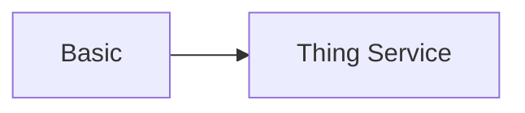

# Intro

## What a basic is
A basic is the smallest unit this example teaches. See also [[intro#What a basic is|this heading]] and [[intro]].

## How basics relate

| Term | Meaning |
|---|---|
| basic | smallest unit |
